# Análisis y diseño Ontomouse
## Juegos de Tablero
En este documento se presenta el análisis, diseño e implementación para la ontología que se utilizarán en el desarrollo de práctica relacionada con el juego [Mouse Run](https://mouse-run.appspot.com/). El diseño de la ontología estará pensado para resolver las necesidades de comunicación de los agentes implicados en las prácticas. Estos agentes estarán diseñados para responder a los eventos necesarios para:
- Localizar a los agentes especializados:
 - Agentes organizadores que serán los encargados de crear las diferentes partidas para un juego con los ratones correspondientes. Serán los encargados de crear los agentes que completan una partida para un laberinto con la lista de ratones que se le ha suministrado.
 - Agentes jugadores para uno o varios juegos. Los agentes corresponden a los ratones que se diseñan que jueguen correctamente, es decir, no tienen la posibilidad para *hacer trampa*.
  
- Realizar las tareas necesarias para que los agentes cumplan correctamente con sus objetivos:
 - Localizar a los agentes jugadores que estén dispuestos a jugar un juego.
 - Localizar un agente organizador para que pueda completar ese juego.
 - Crear los agentes de partida necesarios para cada una de las partidas que componen un juego.
 - Completar los turnos necesarios para una partida individual entre los agentes jugadores.
 - Comunicar el resultado de las diferentes partidas para así completar el resultado del juego.
Como el diseño de la ontología estará enfocado en resolver las necesidades de comunicación entre los agentes se incluirán los diagramas UML para los diferentes protocolos de comunicación entre **agentes-FIPA** que deben implementarse para que todos los agentes puedan participar independientemente del grupo que los desarrolle.

## Análisis 
En este apartado se procederá a enumerar los agentes necesarios para el juego del ratón y el laberinto. juego involucra a múltiples agentes, cada uno de los cuales tiene un rol y responsabilidades específicas. El juego es coordinado por un agente, llamado **AgenteMonitor**, que interactúa con otros agentes, como **AgenteRatón**, **AgentePartida** y **AgenteLaberinto**, para organizar y ejecutar los juegos. La ontología que utilizamos para la comunicación entre los agentes está bien definida, lo que facilita las interacciones y la cooperación entre ellos.

### Agentes necesarios
1.  **AgenteMonitor**: Este agente coordina la realización de todos los juegos posibles y la presentación de los resultados de esos juegos. Se encarga de leer la configuración del juego, crear agentes especializados (como AgenteRatón y AgenteLaberinto), organizar y coordinar los juegos y recoger y almacenar los resultados de los juegos.
    
2.  **AgenteRatón**: Este agente representa al jugador en los juegos. Sus responsabilidades incluyen aceptar la propuesta de un juego del AgenteMonitor y realizar movimientos en el laberinto durante un juego.
    
3.  **AgenteLaberinto**: Este agente organiza las partidas del juego. Sus tareas incluyen aceptar la organización de un juego propuesto por el AgenteMonitor, generar partidas para el juego  que está organizando, crear un AgentePartida para cada partida y obtener y guardar los resultados de las partidas.
    
4.  **AgentePartida**: Este agente es responsable de organizar una partida individual. Sus tareas incluyen crear el laberinto con los parámetros de configuración, organizar los turnos de juego, visualizar el resultado de la partida y comunicar el resultado de la partida al AgenteLaberinto.

#### Agente Monitor

El AgenteMonitor trabaja con otros agentes especializados, como los AgentesRatón y los AgentesLaberinto, para llevar a cabo su trabajo. Su comportamiento se guía en gran medida por una configuración del juego, que se le proporciona al inicio y que puede incluir información sobre qué AgentesRatón y AgentesLaberinto están disponibles para jugar, y qué juegos deben realizarse.

#### Tareas principales del AgenteMonitor

-  **Organizar jugadores y juegos**: El AgenteMonitor utiliza la configuración del juego para determinar cuántos y cuáles AgentesRatón y AgentesLaberinto deben participar en cada juego. Luego, envía solicitudes a estos agentes para organizar los juegos. Esta tarea puede incluir la organización de varios juegos simultáneos, así como la realización de juegos de demostración o competitivos según las necesidades.

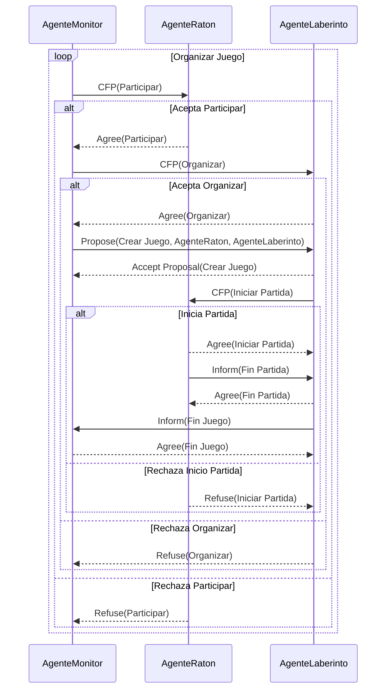

-  **Coordinar con AgentesLaberinto**: Para cada juego que necesita ser organizado, el AgenteMonitor debe localizar un AgenteLaberinto adecuado y enviarle una solicitud para que organice el juego.
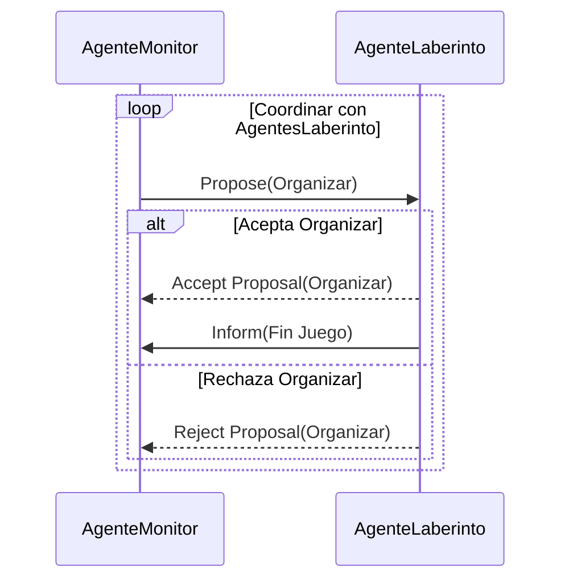
-  **Seguimiento de los resultados del juego**: Una vez que un juego ha terminado, el AgenteMonitor recoge los resultados del AgenteLaberinto y los almacena para su posterior consulta. Este registro de resultados podría guardarse en un archivo o en una base de datos, dependiendo de los requerimientos del sistema.
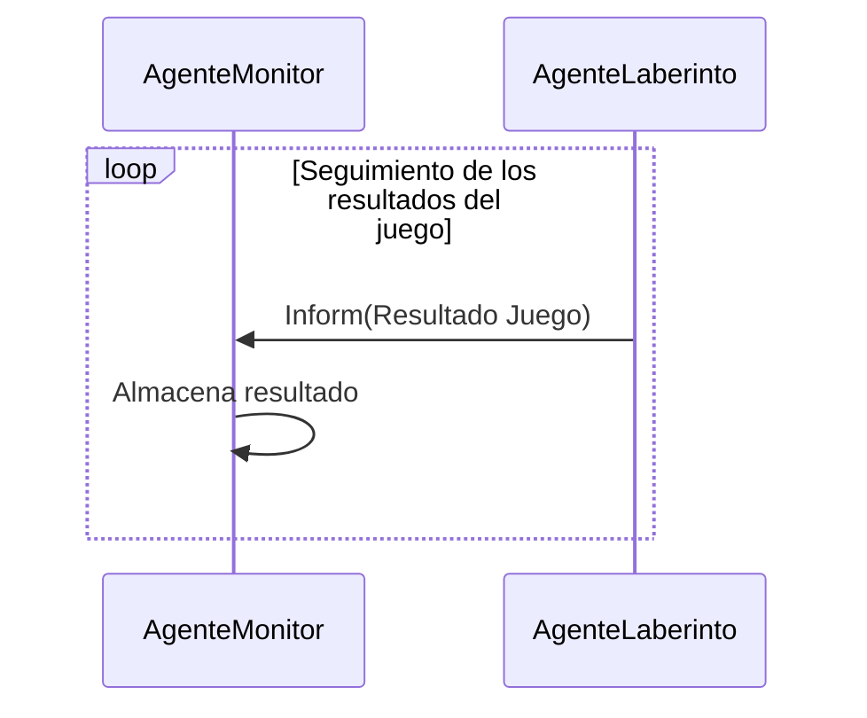
    
- **Proporcionar una interfaz para consultar los resultados**: Además de almacenar los resultados de los juegos, el AgenteMonitor puede proporcionar una interfaz a través de la cual los usuarios pueden consultar estos resultados. Esta interfaz podría ser una interfaz de usuario gráfica, una interfaz de línea de comandos, o incluso una API web, dependiendo de los requerimientos del sistema.

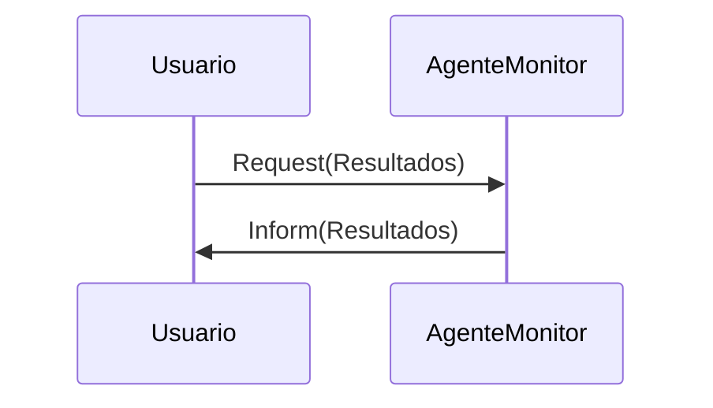

#### Tareas principales del AgenteRatón
- **Suscripción a las páginas amarillas**:
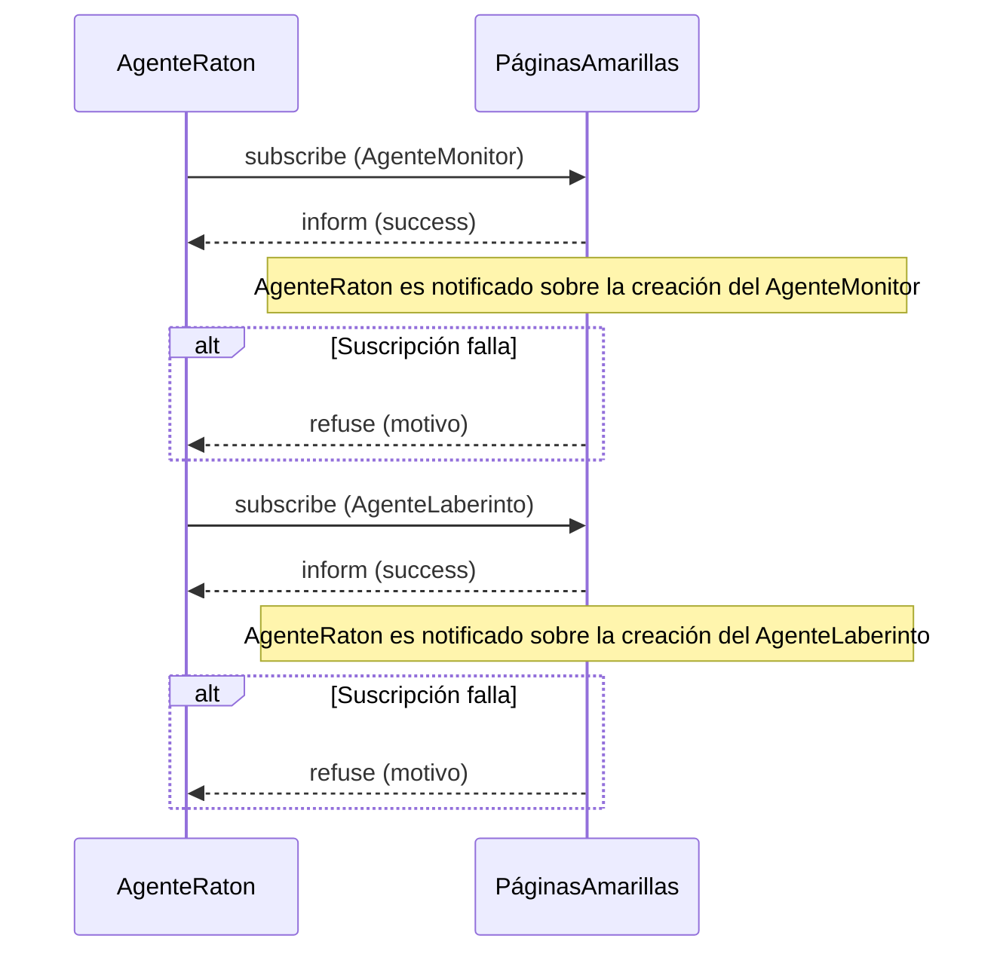
-  **Aceptar invitaciones a los juegos**: El AgenteRaton debe estar dispuesto a aceptar la invitación a un juego propuesto por el AgenteMonitor. Debe estar listo para aceptar jugar al menos en 3 juegos simultáneos.
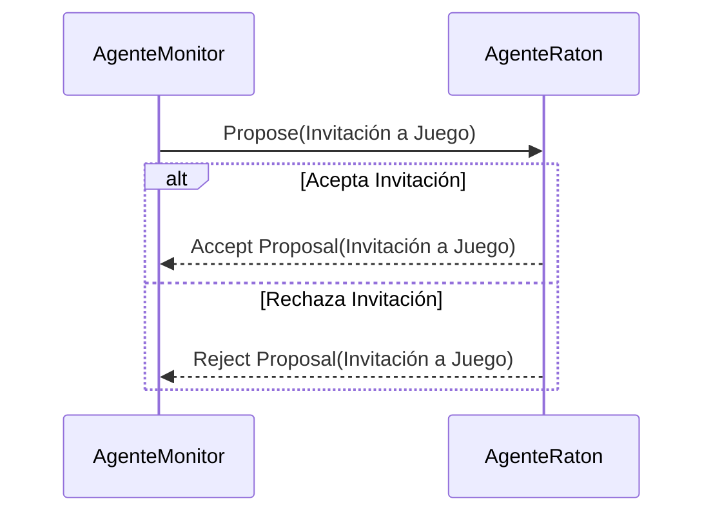

-  **Participar en juegos**: Una vez que el AgenteRaton acepta la invitación, deberá participar en el juego. Esto significa que tiene que realizar los movimientos correspondientes dentro del laberinto durante su turno. Debe tener en cuenta los dos modos de juego disponibles: competitivo o de búsqueda.
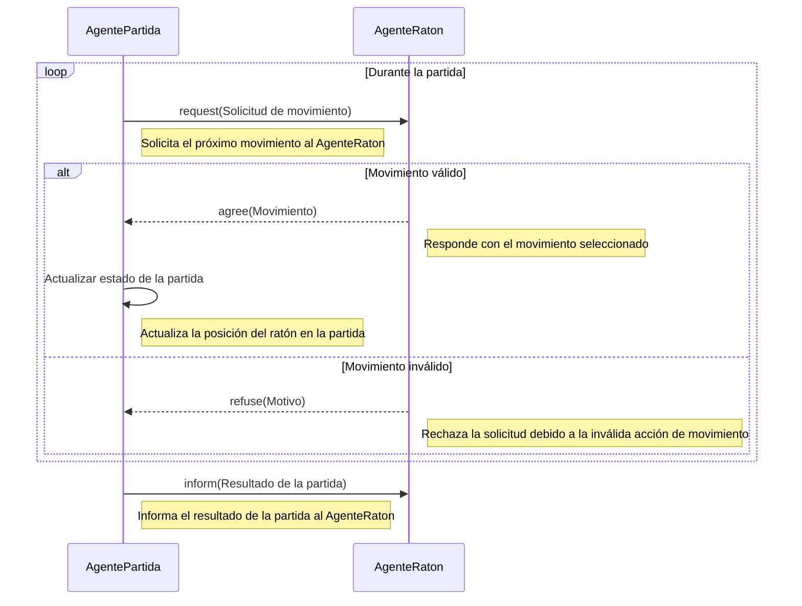

#### Tareas principales del AgenteLaberinto
- **Suscripción a las páginas amarillas**: Esta tarea comprende las operaciones necesarias para que el AgenteLaberinto se suscriba a las notificaciones de creación de los AgentesMonitor y AgentesRaton en la plataforma. Esto permite al AgenteLaberinto mantenerse actualizado sobre las novedades de estos agentes, como su disponibilidad para los juegos. En caso de una suscripción exitosa, el agente recibe una confirmación. Sin embargo, si la suscripción falla, recibe un mensaje de rechazo indicando el motivo.
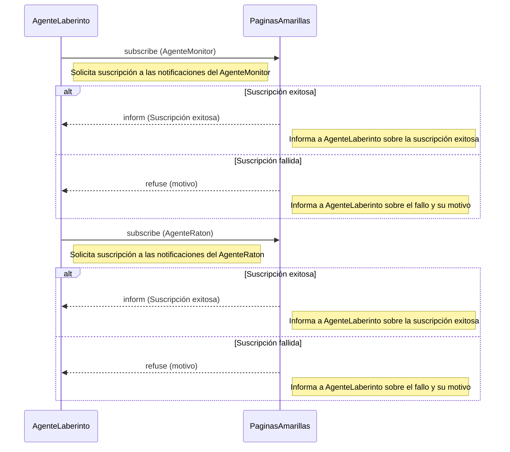
-  **Aceptar la organización de juegos**: Esta tarea consiste en recibir las solicitudes del AgenteMonitor para organizar un juego. Como mínimo, debe aceptar organizar 3 juegos simultáneos.
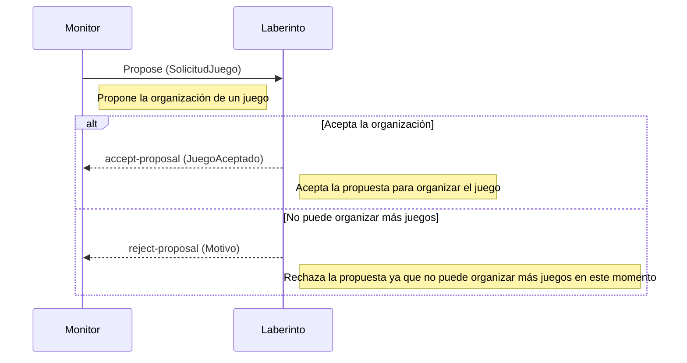
- **Crear el AgentePartida**: Para cada partida, el AgenteLaberinto debe crear un AgentePartida. Este AgentePartida se encargará de coordinar los movimientos dentro del laberinto.
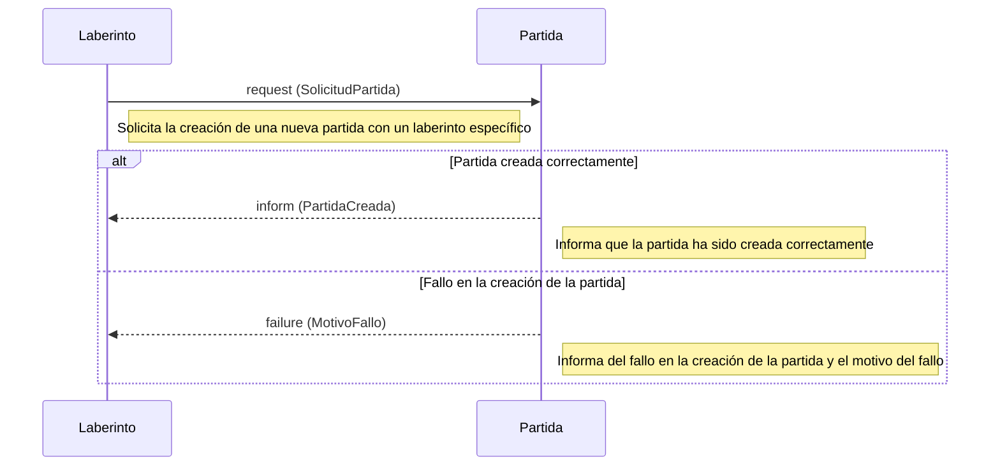
    
-  **Generar las partidas**: Para cada juego que está organizando, el AgenteLaberinto debe crear las partidas, que están representadas por los laberintos. La forma en que organiza estas partidas depende del tipo de juego que está organizando.
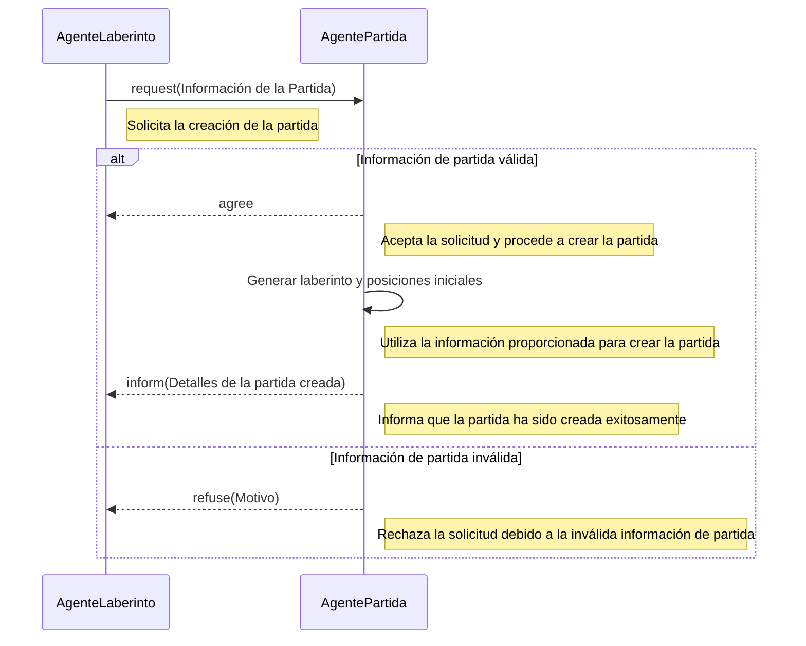
   
    
-  **Obtener resultados de las partidas**: Una vez que una partida ha terminado, el AgenteLaberinto debe obtener los resultados de la partida. Estos resultados se utilizarán para determinar los resultados del juego en general.
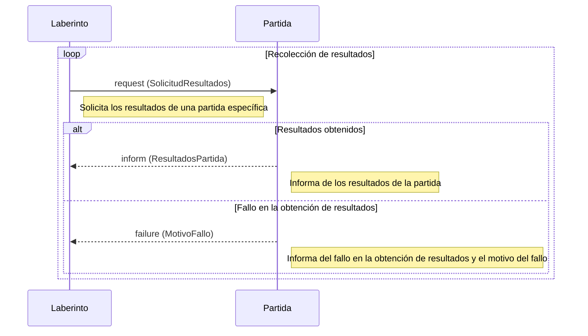
    
-  **Guardar registro de las partidas**: El AgenteLaberinto debe mantener un registro de todas las partidas que ha organizado. Este registro podría ser necesario si se solicita la reproducción de una partida una vez que ha finalizado.
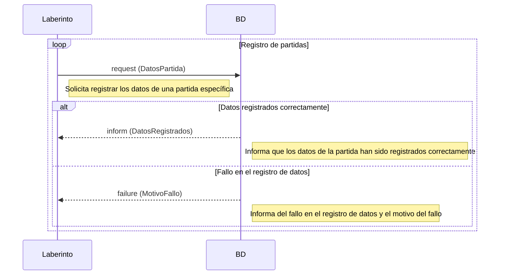
    
-  **Informar los resultados del juego**: Una vez que todas las partidas de un juego han terminado, el AgenteLaberinto debe informar los resultados del juego al AgenteMonitor que solicitó la organización del juego.
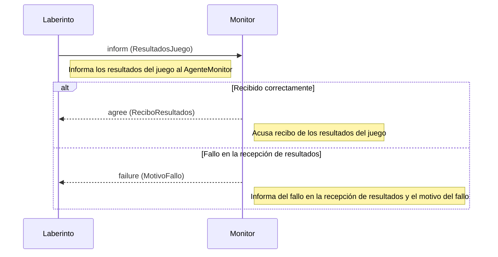

#### Tareas principales del AgentePartida
- **Crear la partida**: Esta tarea involucra la generación de la partida basándose en la información proporcionada por el AgenteLaberinto. Esta información incluiría las reglas del juego, la estructura del laberinto y la posición inicial de los agentes Ratón.

    
-  **Gestionar la partida**: Durante esta tarea, el AgentePartida coordina el desarrollo de la partida, gestionando las acciones de los AgentesRatón, verificando las condiciones de victoria y controlando el avance de la partida.

    
    
-  **Informar los resultados**: Finalmente, el AgentePartida comunica los resultados del juego a los agentes participantes y al AgenteMonitor, permitiendo la visualización y análisis de estos datos.
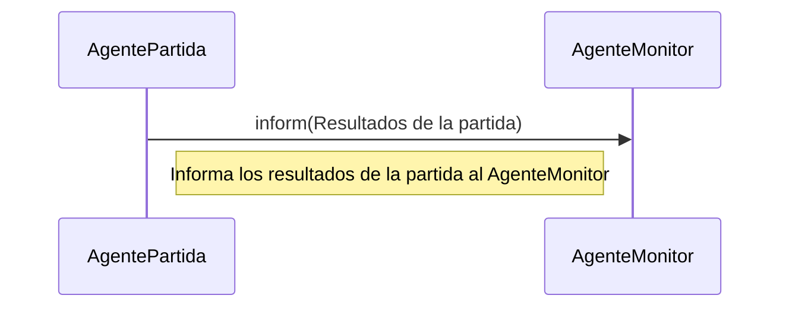
## Diseño